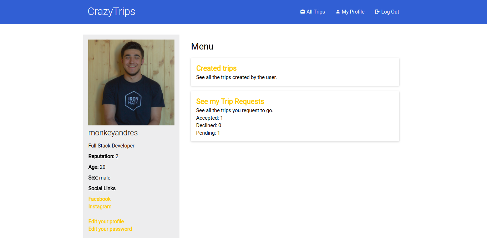

# CrazyTrips

CrazyTrips is a platform where you can organice your own trips or join other's.
Actually is in maintenance mode because of a licensing problem.

> You need to have node and npm installed.

### Installation
```bash
git clone https://github.com/CrazyTrips/crazytrips.git
cd crazytrips
npm install
```
### Usage

```
npm start
```

### Features

* Develop in just one week
* Backend with NodeJS and Express
* Front with JS ES6, SASS and HTML
* Auth with PassportJS & bcript
* Sessions with mongo and expressJS
* Mailing for confirm account
* NodeMailer with HBS template
* Upload asserts with multer to Cloudinary
* Froala as a WYSIWYG
* Logs with morgan
* Templating with HandlebarsJS
* Fully responsive design

### To Do

* A lot of code refactor (no time in one week for clean code -.-)
* Change the WYSIWYG editor
* Refactor the code as an API and make frontend AJAX requests
* Maybe front in React...

### Screenshots




